Overview
========

In this hands-on lab, we will be demonstrating a typical EAI message endpoint
pattern implementation with Azure Logic App and APIM.

In real world, each trading partner can use different protocols such as FTP,
HTTP and Queue…etc; Message pattern in EAI is to separate message sending and
receiving process with message channel, so that each part knows only small
pieces of the message processing process.

A high-level overview of the architecture illustrated below.

-   Trading Partner represents the organization that will be sending or
    receiving documents (sales orders for example).

-   Adapter Flow represents a sub-flow that handles incoming and outgoing
    messages, including transform and validation.

-   Transaction Flow is the flow to process this message, including enrich
    messages.

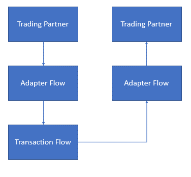

We will use this hands-on lab to create above flow. Below function and services
will be covered in this document.

-   Logic App

-   API Management

-   Azure AD

-   Azure Functions

-   Monitoring your flow

Prerequisites
=============

-   Azure Subscription

-   Visual Studio Code

-   Visual Studio Community + (For creating frontend and backend API)

Table of Content
================

-   Preparation

    -   Create a Backend API App

-   Create you flow

    -   [Integration
        Account](create-receiver-adapter.md#create-an-integration-account)

    -   [Service Bus Queue](create-receiver-adapter.md#create-service-bus-queue)

    -   [Receiver Adapter](create-receiver-adapter.md)

    -   [Send Adapter](create-send-adapter.md)

    -   [Business Flow](create-business-flow.md) and Handle API with Azure AD
        Authentication

-   Manage your API

    -   APIM integration with Logic App

    -   Azure AD integration with your backend API

    -   Create a sample frontend app

-   Monitor your business flow with built-in services

Create a Backend API App
========================

-   For simplicity sake, we’ve prepare a backend [REST
    API](../source/EAIBackendAPI). It only echoes back fixed string in this lab,
    you can modify it to fit your requirement.

-   Open the solution file with Visual Studio and deploy to you Azure
    Subscription

-   Make sure you see below results.

Register Frontend
-----------------

Configure Backend API AAD
=========================

-   Enable Backend API’s AAD authentication

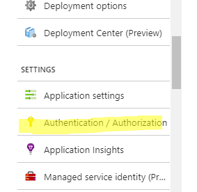

APIM
====

-   Create from Swagger File

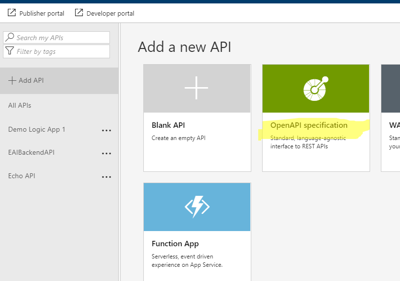

-   Upload Swagger file and specify an API URL suffix

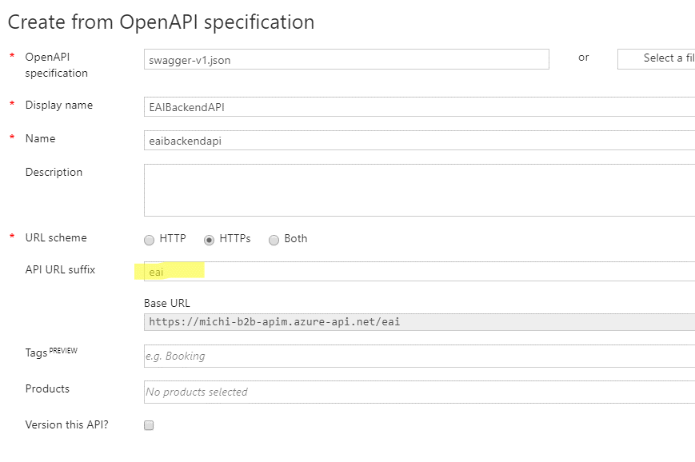

-   Configure Azure AD OAuth Integration

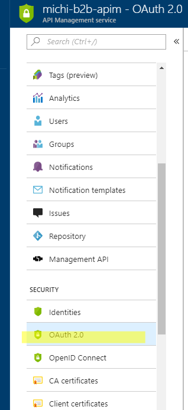

-   First part

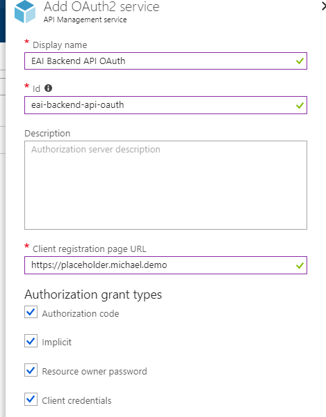

-   Get Endpoints from Azure AD console

-   Second part

-   Grant Type (For OAuth)

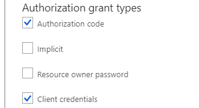

-   Get Backend Application Id from Azure AD

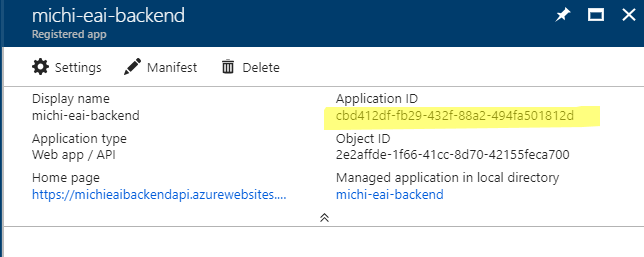

-   Paste it here

-   Specify Client Credential, Retrieve Client ID and Secret from Azure AD app
    page

-   Paste it here

-   Note down Reply URL

-   Complete

-   Got back to API, Settings

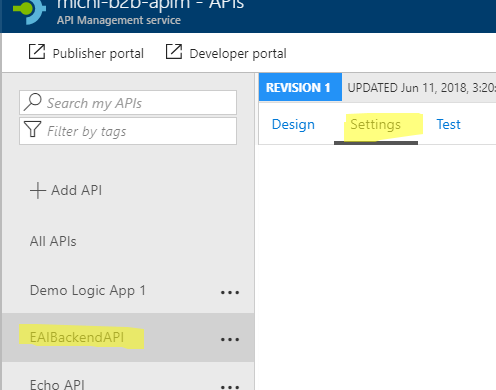

-   Choose OAuth Authentication we just created

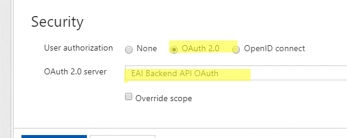

-   Get back to APIM, Create or Add our API to a product

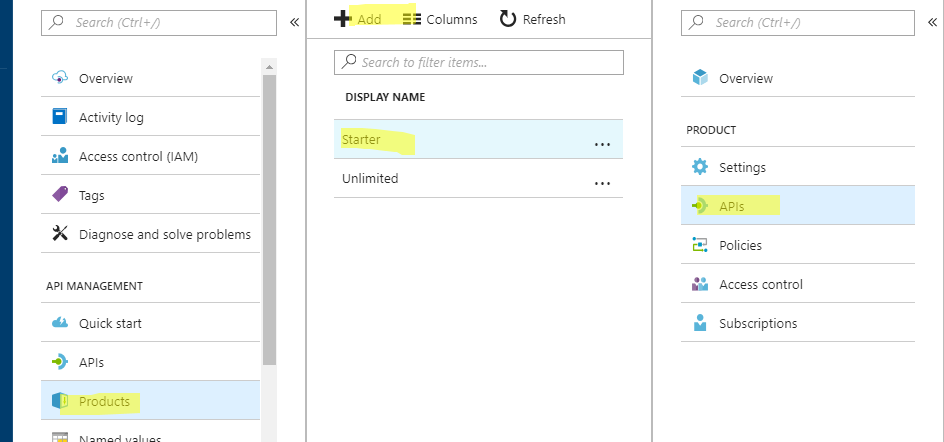

-   Go to Azure AD, we need to update Frontend App’s Reply URL

