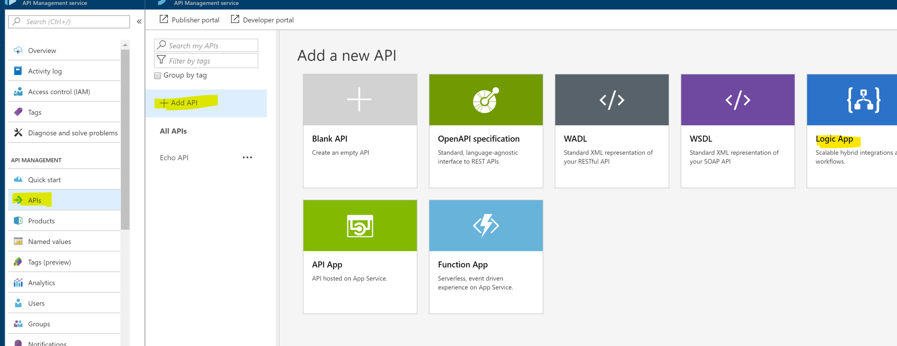
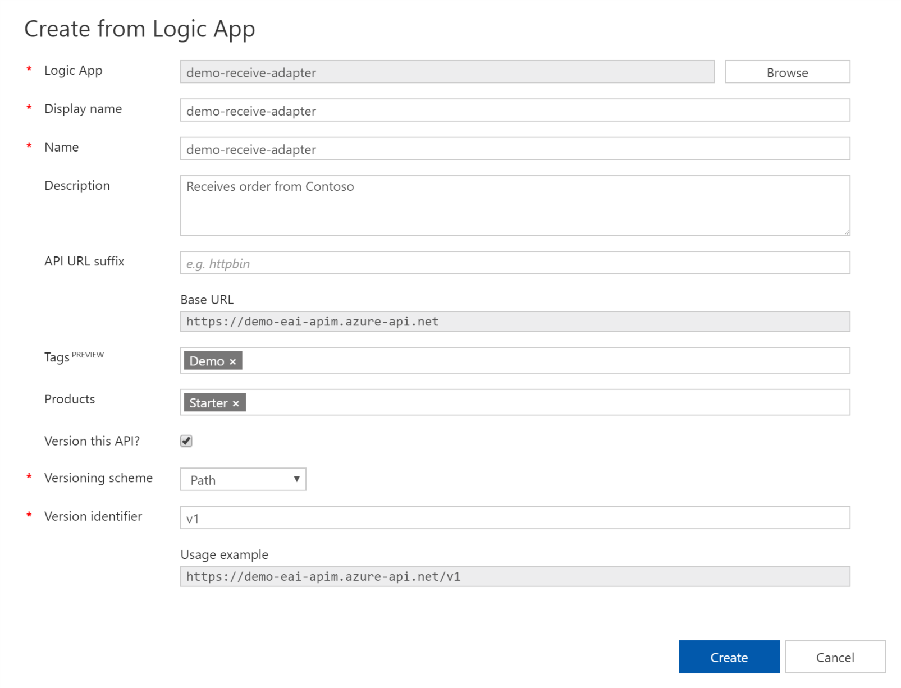
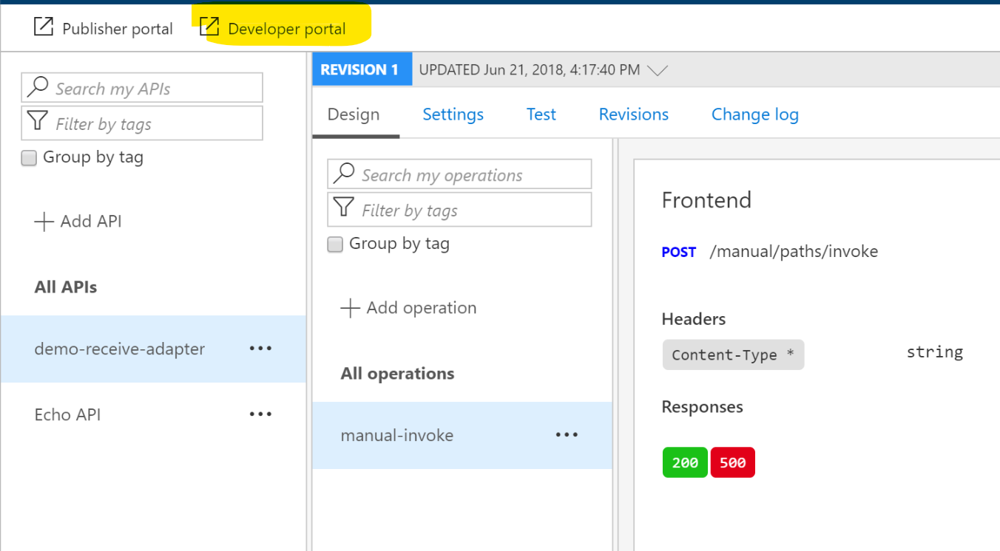
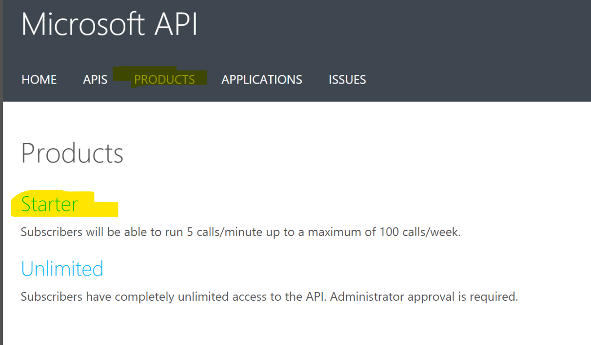
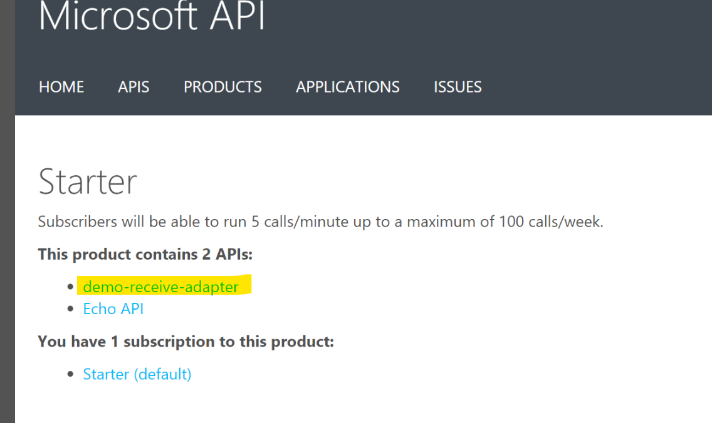
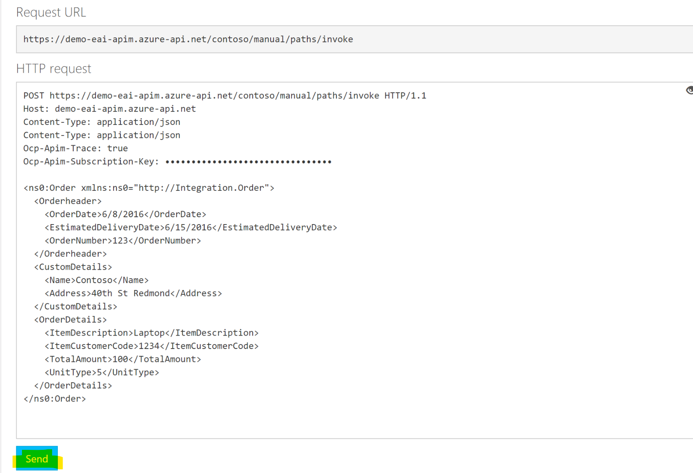
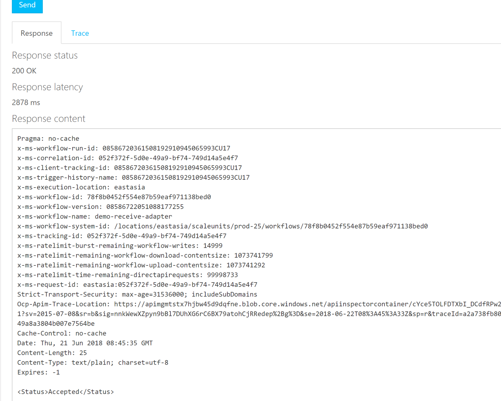
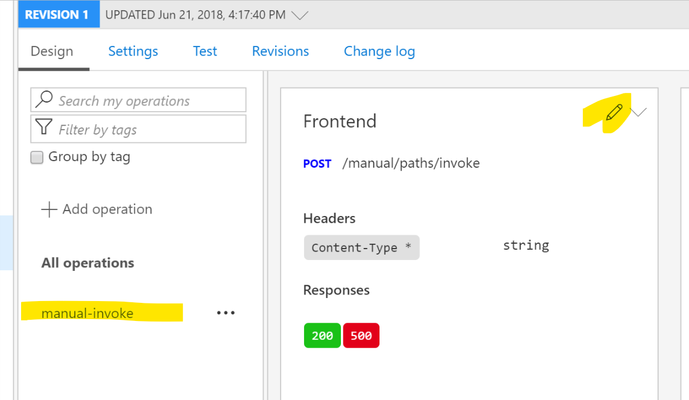
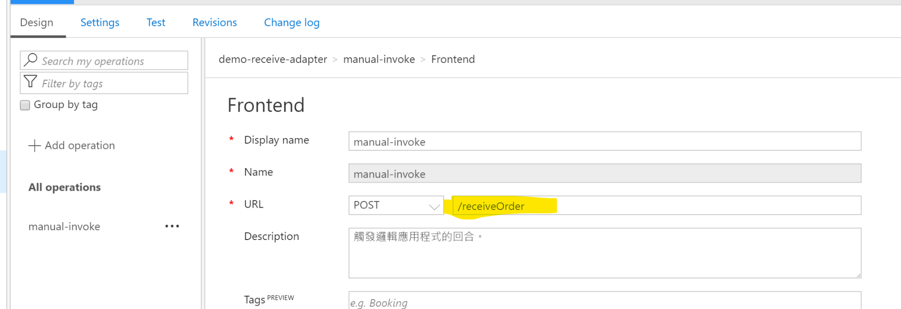
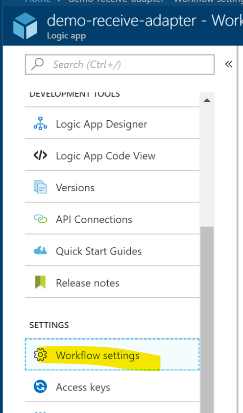

# Overview

An API Management instance is an API gateway that provides throttling control,
access restriction control and management to your APIs. In this lab we will be
managing our APIs with APIM and configure access restriction policy to restrict
access to our APIs.

In this document we will be demonstrating how APIM protects and manages your
backend API. We will configure APIM to allow and check Oauth 2.0 based
authentication token. We will also configure Logic App to allow traffic from
APIM only so that your Logic App is protected by APIM with Oauth 2.0.

# Prerequirests

-   Azure Subscription

-   Complete [Backend API Azure AD setup](backendapi-setup-azuread.md) and
    [business flow Logic Apps](create-business-flow.md)

# Create an APIM managed Logic App API

-   Goto Azure Portal, create an empty APIM instance, here I choose Basic tier,
    for development and testing purpose, Developer tier is sufficient.

-   Once created, open up Essential Blade, copy the VIP address of APIM
    instance, we will need it later.

-   Next, we will be creating a set of “API”, which backed by our Logic App so
    that client (the Trading partner) does not directly interact with Logic App
    but go througth APIM. Hence we have opportunity to manage and monitor usage
    from different partners.

-   To create new API, click API in left panel, Add API then Logic App

-   Choose the receiver adapter Logic App we created earlier.

    -   API URL suffix will be added to the end of your API URL, if your API
        come with query string then it can make API call not functional properly

    -   Tags can be any text

    -   Product is how you group your APIs into a set of APIs provided to your
        customers. We use default Product “Starter” here, you can create new one
        if you like

    -   Versioning

        -   Check “Vision this API” if you expect to provide different version
            of API

        -   Versioning schema is how your APIs differenciate between different
            API versions

        -   Version identifier will be added to your URL to differenciate
            different versions

# Verify APIM APIs

-   Once created, you shoud see screen similar like this. To verify our work,
    click Developer portal to bring up developer portal.

-   As we are the administrator of this API, we are automatically signed in.
    Click Products, then click on the Products we added the receiver adapter
    API, in this case, “Starter”.

-   Click the API we added

-   Click “Try it”to test the API

-   Paste sample request XML and click Send button in the bottom of test page

-   If everything works well, you should see below response. Now our Logic App
    is ready to accept order from our trading partners.

-   If required, you can change the URL schema in APIM. Go to APIM, APIs,
    \<Logic API\>, Choose specific operation, Design then click the “Pen” icon

-   Modify URL here

-   Once Saved, go back to Developer Portal, Refresh the test page and Try Again
    you’ll see the request URL has changed.

# Protect Logic App with APIM

In this section, we will be demonstrating protect our Logic App with APIM.

We will first setup Logic App’s IP restriction that only allows traffic coming
from APIM to Logic App.

Then we will configure Azure AD integration on APIM and verify if required claim
exists in JWT token, only when it exists in the token will the request be routed
to backend Logic App.

>   Note that at this moment, Logic App does not allows “Authorization” Http
>   Header, so we will store Oauth token to another Http Header nstead before
>   request routed to Logic App.

Setup Logic App IP whitelist

In this section we will configure Logic App to only allows traffic coming from
APIM

-   Go to Azure portal, open the receiver adapter Logic App then Workflow
    Settings

-   Add APIM’s IP address here then Save

-   Now if you try to POST message to Logic App URL, you will get below error
    message

# Configure APIM with OAuth authentication
