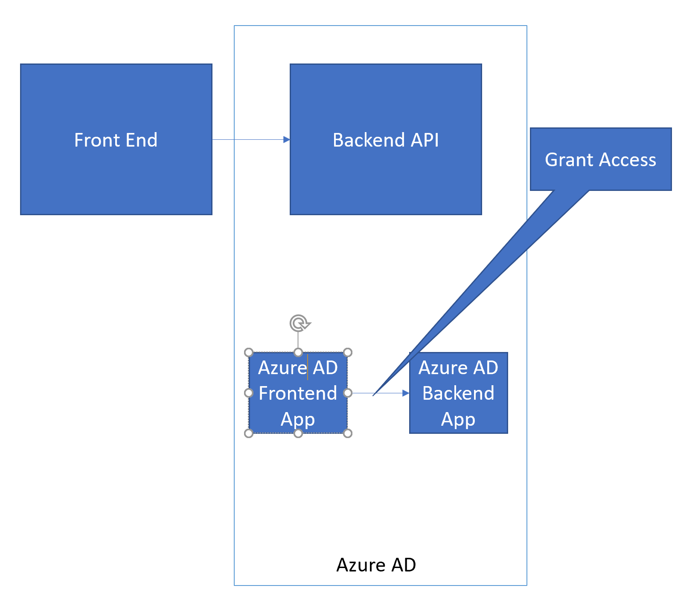
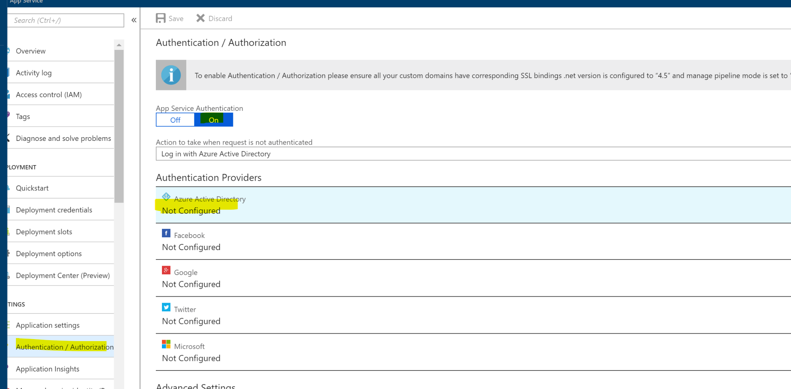
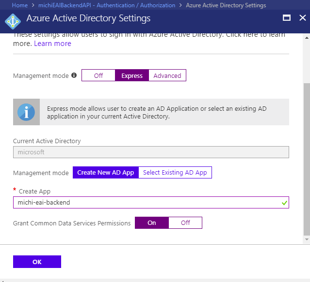
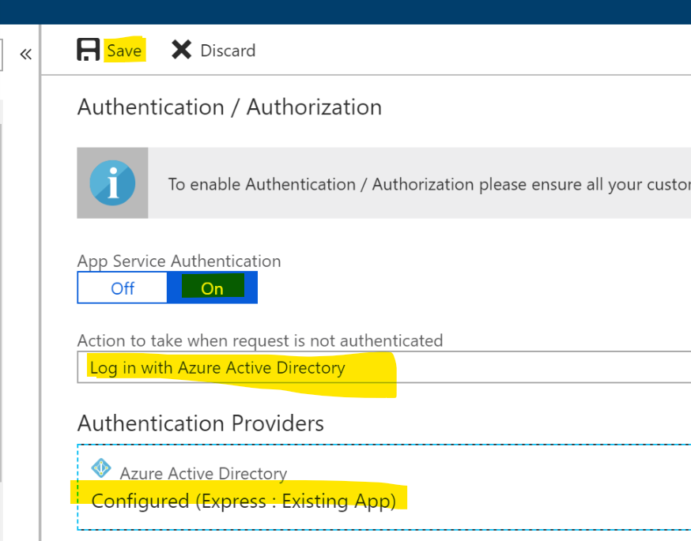
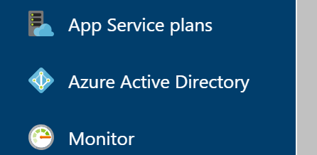
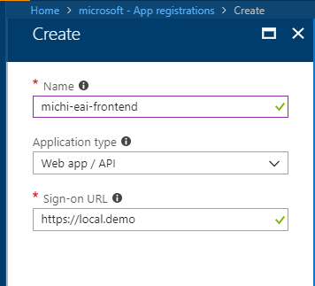
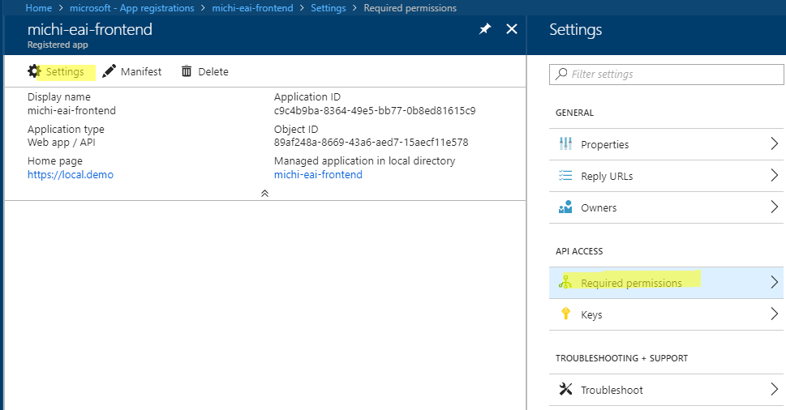
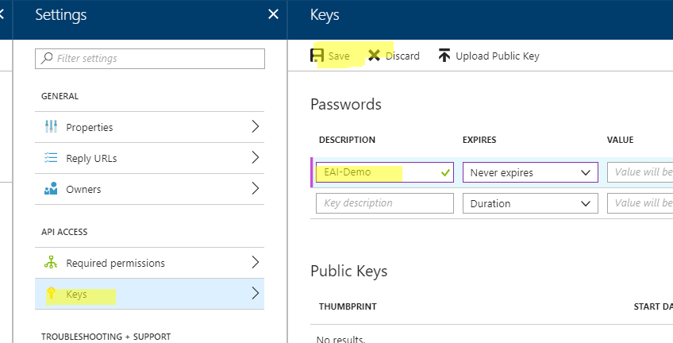
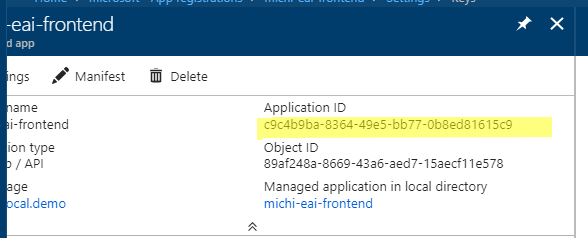
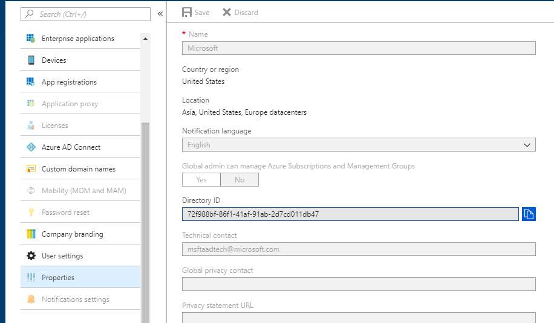

Overview
========

In this document we will be demonstrating how to register your application in
Azure AD and how to configure another Azure AD application as client application
so that your frontend application was authenticated before it can access to your
Azure AD protected backend API.

Steps to accomplish this are divided into several steps

-   Register Backend API in Azure AD and configure Azure AD authentication of
    Backend API

-   Register Frontend App in Azure AD and grant Backend access to this
    application

-   Write custom code to verify result

This document will not include instruction to deploy sample Backend API to Azure
API App, we assume you have done this.

Prerequisites
=============

-   Azure Subscription

-   Deployed Backend API to Azure as a API App or Web App

Configure Azure AD authentication for your Backend API
======================================================

In this section we will be configuring our API App to use Azure AD as its
authentication identity provider. So that access to this application requires
Azure AD authentication.

-   Go back to Azure Portal, open the Backend API’s API Service essential blade.
    Go to Authentication, then Enable Authentication and click Azure Active
    Directory

-   Switch to “Express” mode and create a new application

-   Click OK to go back to previous blade, then switch Action to “Log in with
    Azure Active Directory” then click Save to save changes

-   At this point you have successfully configured Azure AD authentication for
    your backend application. To verify this, open your browser and navigate to
    your backend API, you will be redirected to default AD login page.

-   Go back to Azure Portal, Open Azure AD management blade

-   Go to Application Registration, search for the application we created above

-   Open up application essential blade, properties, and note down Application
    ID. We will need this value so that our frontend application knows to which
    Azure AD application it need to request access.

Register Frontend application
=============================

Now we are good to register an Azure AD application for our frontend
application. You don’t have to have an actual application to register one, this
step is to configure required access permission for future uses.

-   Go to Azure AD management console

-   Create a new Application registration

    -   Name is a unique friendly name

    -   Application Type should be Web app/API

    -   Sign-on URL need to be a valid URL but not necessary an actual URL.

-   Now we need to grant backend API access to our frontend application. Go to
    Settings, Required Permissions.

-   Choose the backend API application we created above

-   Make sure you check required permission

-   Grant permission to our applications

Details of Grant permission :
<https://docs.microsoft.com/en-us/azure/active-directory/develop/active-directory-integrating-applications>

-   Create a Key for Frontend App, this key is referred as Client Secret in your
    frontend application. Note that this key will only be shown once after you
    click “Save” so be sure to note it down.

-   Note down Key and Application Id, this will be refered as Client ID in your
    frontend application

Verify Azure AD Authentication with Frontend App

-   I have a frontend application ready [here](../source/EAIFrontEndApp)

-   Open Program.cs and modify placeholder to corresponding values

    -   Authority is the authority URL that will authenticate users, it is in
        the form of
        [https://loing.microsoftonline.com/\<Tenant](https://loing.microsoftonline.com/%3cTenant)
        ID\>

>   A tenant ID is a GUID that represents your Azure AD tenant, it can be found
>   in Azure AD management console -\> Properties -\> Directory ID

-   FRONT_APP_ID is the application Id we copied from Frontend application
    registration step

-   FRONT_APP_KEY is the client secret we generated in Frontend application
    registration step

-   BACKEND_APP_ID is the application Id we copied from Backend application
    registration step.

-   Go to Main(), modify Url to your API URL

-   Hit F5 to run.
